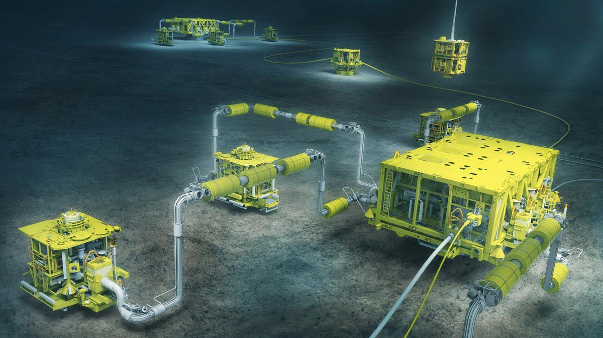

# Final Project - Timeseries Forecasting, Case of Study : Production Gas Rate



## Table of Contents

- [Table of Contents](#table-of-contents)
- [Project Intro](#Project-Intro)
- [Structure](#Project-Structure)
- [Setup](#Setup)
- [Datasets](#Datasets)

## Project Intro

- Forecasting future oil and gas production for a well is one of the most important tasks of a reservoir engineer.
- These production forecasts are used for estimating remaining reserves, optimizing production operations and business planning, among other tasks.
- Similar technique can be implemented in various fields which involved time series data to do the short term forecasting from previous time series data.
- Time series data is touching everything in our lives. For example: stocks price, weather data, sales data, house price, sensors data etc.

- Difference between forecast and prediction:  
  Forecasting problems are a subset of prediction problems wherein both use the historical data and talk about the future events. The only difference between forecasting and prediction is the explicit addition of temporal dimension in forecasting.

### Aim

- Import and analyse the data and perform EDA
- Perform feature engineering
- Split the data to train/test samples
- Use the train dataset to predicting/forecasting the Gas Rate, save the model
- Export the test dataset as JSON and the model to flask
- Use the test data for prediction/forecasting and visualization

## Structure

```

Final Project
|
|__ SQL
|    |__ Wells.sqlite
|
|__ static/
|   |__css/                             # Directory for css stylesheets
|   |  |__ style.css
|   |
|   |__data/                            # Directory for the data files
|   |  |__ Resources/                   # Directory for hitorical SGU data
|   |
|   |__ js/                             # Directory for js files for webpages
|       |__ line.js                     # List of js files
|
|__ templates                           # Directory for flask webpages
|   |__ index.html
|   |__layout.html
|   |__multivariate.html
|   |__plots.html
|
|__ app.py                              # flask app to run the website
|__ LR_model.pkl                        # LR model
|__ univariate_prediction.h5            # LSTM model
|__ Forecasting Presentation            # Presentation of the project
|__ Procfile                            # Heroku file
|__ README.md                           # read me file
|__ requirements.txt                    # Project requirements file
|__ Project Proposal.docx               # Project proposal

```

## Setup

Link to live interactive dashboard Website : [Forecasting Gas Rate](https://forecastinggasrate.herokuapp.com/)

## Datasets

- Petroleum Exploration Society of Australia (PESA) course material

## Contributors

- [Ahmad Makintha Brany](https://github.com/makintha)
- [Rajesh Nair](https://github.com/rajeshnair1984).
